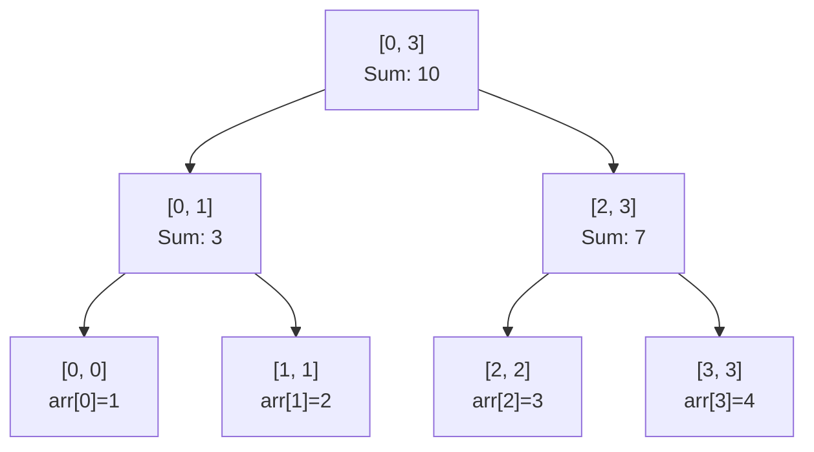

## 簡介

線段樹大概可以想成一個可以幫你快速動態解決區間問題（RMQ）的東西，是一顆二元樹，可以想成是把分治過程存下來的一個資料結構。大概像這樣：



## 性質

-  樹上節點數為 $O(n)$。
-  每個位置頭上最多只有 $O(log(n))$ 個節點。
-  每個區間都可以用 $O(log(n))$ 個節點維護。

## 證明

#### 樹上節點數為 $O(n)$ 

樹上節點是 $O(n)$ 這件事可以用 Master Theorem 來證明，在這邊先不證明 Master Theorem，因為我不會。以下為定理的長相：

$$T(n) = a T\left(\frac{n}{b}\right) + f(n) \quad (a \ge 1, b > 1)$$

$$
\begin{cases} 
\text{Case 1: } f(n) = O\left(n^{\log_b a - \epsilon}\right) \text{ for some } \epsilon > 0 
& \implies T(n) = \Theta\left(n^{\log_b a}\right) \\[12pt]
\text{Case 2: } f(n) = \Theta\left(n^{\log_b a} \log^k n\right) \text{ for some } k \ge 0 
& \implies T(n) = \Theta\left(n^{\log_b a} \log^{k+1} n\right) \\[12pt]
\text{Case 3: } f(n) = \Omega\left(n^{\log_b a + \epsilon}\right) \text{ for some } \epsilon > 0 \\
\quad\quad\;\;\; \text{and } a f\left(\frac{n}{b}\right) \le c f(n) \text{ for some } c < 1 \text{ and large } n 
& \implies T(n) = \Theta\big(f(n)\big)
\end{cases}
$$

白話點的話，a 就是你每層叫幾次遞迴，b 就是每次遞迴會切成多大的子問題，$f(n)$ 就是每次合併和分裂需要的操作複雜度。定理本身在講的事大概就是看 $n^{\log_{b}a}$ 的層級還是 $f(n)$ 比較大，複雜度就由誰決定，一樣大的話就加一個 log 。 

所以回到線段樹，它每次都是分下去兩個大小為 $n/2$ 的子節點，所以 a 跟 b 都是 2，然後 $f(n)$ 只有常數級別，所以套進主定理就得證了。

#### 每個位置頭上最多只有 $O(log(n))$ 個節點

這其實蠻顯然的，畢竟每次遞迴大小減半的話只需要 log 的操作次數就可以遞迴到底，換句話說這也就是每個節點頭上最多會有多少節點覆蓋。

#### 每個區間都可以用 $O(log(n))$ 個節點維護

這件事就沒那麼直觀了，我們分 case 討論。
首先，在詢問 $[L,R]$ 區間時，如果 L 跟 R 都在同一側子樹的話那就直接大小砍半，否則，當兩端點被分開以後，只會發生一次兩個子節點都只被詢問區間部分包含的狀況，為什麼？因為不管怎樣，切開以後詢問區間一定會是子區間的前後綴，這樣之後再切的時候只會出現兩種狀況：

- 前後綴長度過半導致一邊部分包含一邊全包含。
- 長度沒過半所以一邊部分包含一邊是空的。

不管怎樣，只要是全包含或是完全不包含就可以直接使用節點資訊不用再遞迴下去，所以大小也一樣會減半。所以我們就能知道在詢問區間的時候只會有至多一次詢問大小沒被砍半，所以複雜度一樣會是 $O(log(n))$ 。

## 模板程式碼

```cpp
#define lc id<<1

#define rc (id<<1)|1

const int N=2e5;

struct SEG{

int seg[4*N];

int arr[N];

void pull(int id){

seg[id]=seg[lc]+seg[rc]; //這邊視線段樹功能而定

}

void build(int l,int r,int id){ //初始化

if(l==r){

seg[id]=arr[r];

return;

}

int mid=l+(r-l)/2;

build(l,mid,lc);

build(mid+1,r,rc);

pull(id);

}

  

void upd(int l,int r,int pos,int id,int val){ //單點改值

if(l==r){

seg[id]=arr[pos]=val;

return;

}

int mid=l+(r-l)/2;

if(pos<=mid) upd(l,mid,pos,lc,val);

else upd(mid+1,r,pos,rc,val);

pull(id);

}

  

int query(int l,int r,int ql,int qr,int id){ //區間詢問

if(ql<=l&&r<=qr) return seg[id];

int res=0;

int mid=l+(r-l)/2;

if(ql<=mid) res+=query(l,mid,ql,qr,lc);

if(qr>mid) res+=query(mid+1,r,ql,qr,rc);

return res;

}

};
```

